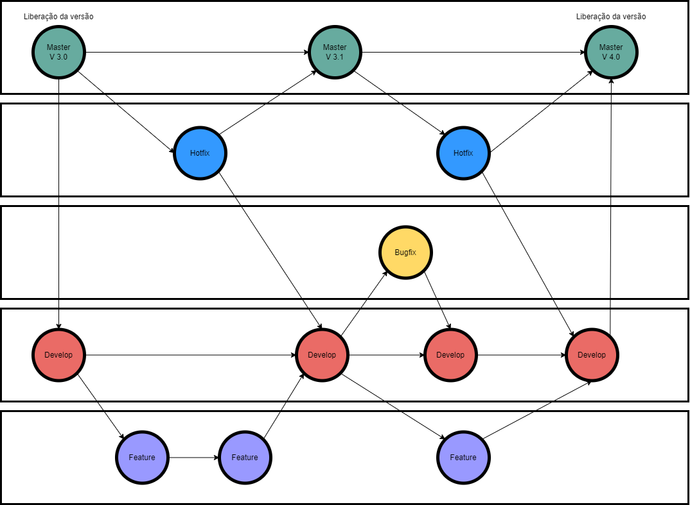
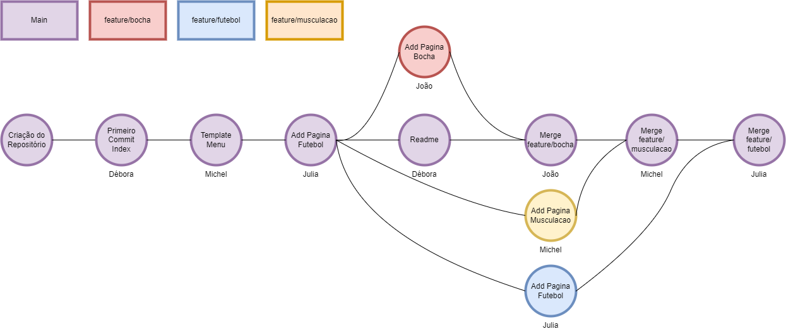
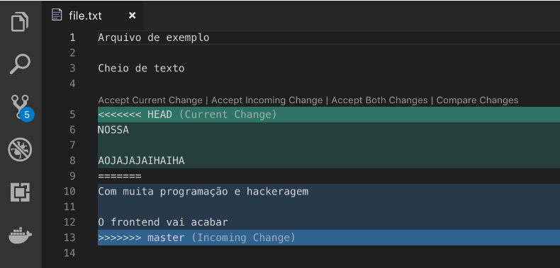

<h1>Gitflow</h1>

<h2>Fluxo</h2>



<h3>Master</h3>


Nesta branch está o código do produto que está em produção, liberado para os clientes, o qual ocorre uma atualização e liberação de nova versão a cada intervalo de tempo (quize dias, por exemplo). 
A master realiza merges os códigos testados da branch develop e pode receber alterações de hotfix.


<h3>Develop</h3>

<pre>Nesta branch está o código do produto em staging ou pré produção, onde ocorrem os testes antes que o produto seja liberado para utilização dos clientes, podendo ser realizadas alterações diariamente, geralmente por deploy. 
Recebe modificações vindas de features e bugfix.</pre>

<h3>Hotfix</h3>

<pre>Esta branch criada a partir da master é utilizada quando existe a necessidade de realizar uma correção diretamente dentro do ambiente de produção (master). 
Geralmente para aplicar correções críticas, que necessitam ser colocadas rapidamente em produção. 
Após ser fechada, a hotfix é finalizada e passa a fazer parte tanto do ambiente de staging quanto de produção (merge com develop e master)</pre>

<h3>Bugfix</h3>

<pre>Esta branch deve ser criada quando um erro é detectado durante testes com a equipe de QA, realizados no ambiente de staging. 
Se aplica a features novas que ainda não fazem parte do ambiente de produção e portanto se iniciam e encerram a partir da branch develop.</pre>

<h3>Feature</h3>

<pre>Esta branch é criada ao iniciar uma nova funcionalidade no projeto, que receberá novos commits com o código específico para esta determinada funcionalidade, como a criação de uma nova tela de cadastro, por exemplo. 
Quando o desenvolvimento da funcionalidade for concluído, a branch é integrada ao código do ambiente de staging, ou seja, a develop.</pre>

<h2>Fluxo do tabalho realizado:</h2>



<h2>Orientações para a utilização do github como versionamento de software.</h2>

<pre>
Primeiramente, se faz necessária a criação repositório no github. 

Após isso, no computador, entrar no diretório em que deseja clonar o repositório.

O criador do repositório deve adicionar outros colaboradores ao projeto em Settings -> Collaborators.

Colaboradores devem aceitar se juntar ao projeto em Organizations -> Join -> Accept invite.
</pre>


<h2>DA UTILIZAÇÃO DO GIT</h2>

<h3>Configurar usuario no seu git</h3>

```
git config --global user.email “email@email.com”
```

```
git config --global user.name “nome”
```

<h3>Clonar repositório remoto existente para o local de trabalho</h3>

```
git clone https://github.com/drsavi/gitflow.git
```

<h3>Exibir as condições (status) do diretório de trabalho e da área de staging</h3>

```
git status
```

<h3>Adicionar alterações para o próximo commit</h3>

```
git add {nome do arquivo} {ou . pra incluir tudo}
```

<h3>Adicionar alterações adicionadas na area de staging para o repositório</h3>

```
git commit -m "mensagem"
```

<h3>Enviar o conteúdo do repositório local para um repositório remoto</h3>

```
git push
```
ou quando for o primeiro commit do repositório:

```
git push -u origin HEAD
```

<h3>Exibir todas as branchs </h3>

```
git branch -a
```

<h3>Criar nova branc</h3>

```
git checkout -b {nome da nova branch}
```

<h3>Mudar de branch</h3>

```
git checkout {nome da branch}
```

<h3>Apagar branch local</h3>

```
git branch -D {nome da branch}
```

<h3>Apagar branch remota</h3>

```
git push origin --delete {nome da branch}
```

<h3>Arquivar alterações não commitadas do seu local de trabalho</h3>

```
git stash
```

<h3>Aplicar as mudanças de um stash à área de trabalho </h3>

```
git stash pop
```

<h3>Unir duas branchs (se faz necessário realizar checkout para a branch que deseja aplicar as modificações)</h3>

```
git merge {nome da outra branch}
```

<h2>Resolução de conflitos utilizando Git e VsCode</h2>

Para configurar o VS Code como editor padrão, basta rodar o comando no terminal:

```
git config --global core.editor "code --wait"
```

E quando precisarmos do editor, quem vai aparecer é o VS Code. Como nos casos de rebase, merge, commit, add -p, etc.

Para garantir que realmente houveram alterações, podemos rodar o comando que abre as configurações globais do Git no editor de textos e o VS Code irá abrir automágicamente:

```
git config --global -e
```

Agora, para adicionar o VS Code como nossa ferramenta padrão de merge, vamos rodar o comando git config --global -e e adicionar as linhas:

```
[merge]
	tool = vscode
[mergetool "vscode"]
	cmd = code --wait $MERGED
[diff]
	tool = vscode
[difftool "vscode"]
	cmd = code --wait --diff
```


Agora basta rodar o comando git mergetool em um merge com conflitos.

Exemplo:


Digamos que eu acabei de rodar o git merge master em uma branch que estava desatualizada.

Ao rodar o git status vemos que aconteceu um conflito.

Podemos então rodar o git mergetool e o Visual Studio Code irá abrir com a interface para correção dos conflitos.

Aparecerá uma tela como essa:



Onde o que está em verde é o que temos em nossa branch e o que está em azul são as alterações que devemos escolher se aceitamos ou não.

Logo acima das alterações temos os botões para aceitar ou recusar uma alteração:

| Botões             | Resultado                                                        |
|--------------------|------------------------------------------------------------------|
|Accept Current Change | Aceitar a mudança que temos localmente/em nossa branch atual   |
|Accept Incoming Change| Aceitar a mudança que estamos recebendo de outra branch/remoto |
|Accept Both Changes   | Aceitar ambas as alterações                                    |
|Compare Changes       | Comparar as alterações                                         |